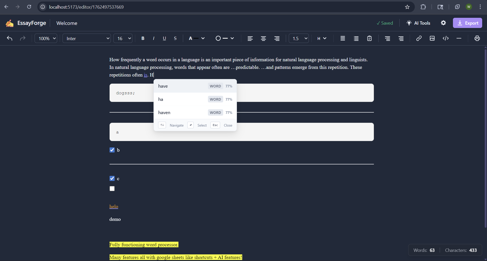
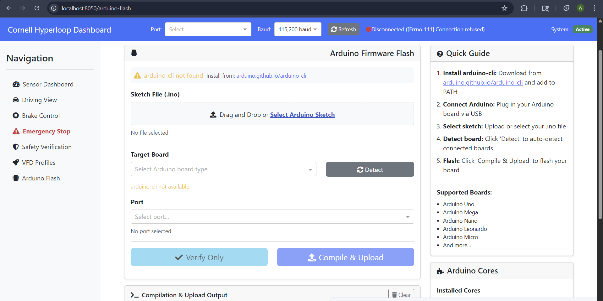
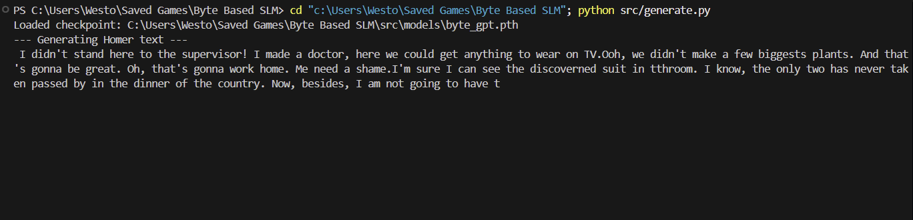
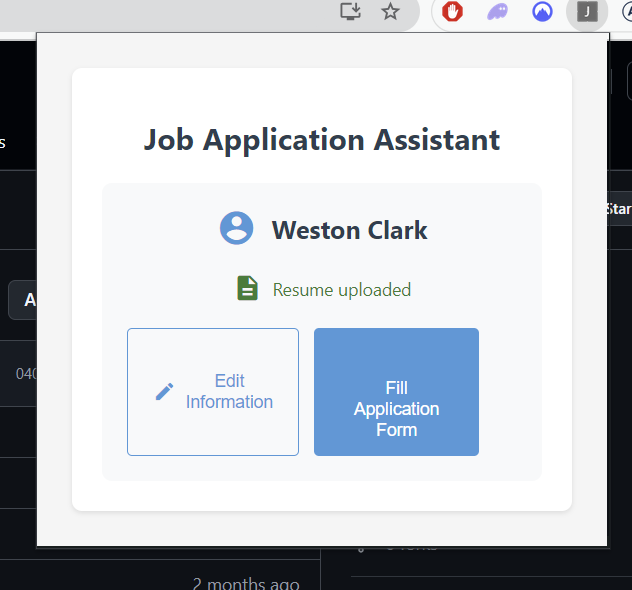
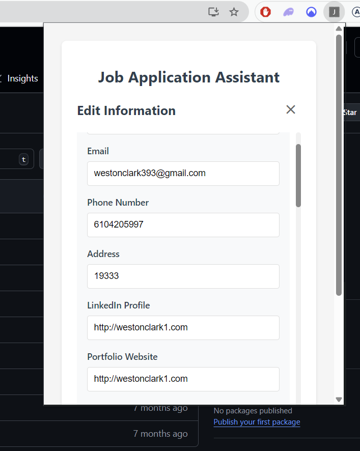

# Hi, I'm Weston Clark

)

 **Cornell Engineering** — Computer Science major, planning an ECE minor  
 Systems architect, hackathon builder, and modular problem solver  
 Passionate about blending **engineering rigor** with **creative design**

---

##  What You'll Find Here
- **Personal Projects** → Creative experiments and technical explorations  
- **Blockchain Projects** → Decentralized systems, consensus mechanisms, and secure protocols  
- **Hyperloop Projects** → Simulation, control, and optimization for futuristic transport  

---

 Quick Skills Snapshot

| Category        | Skills & Tools |
|-----------------|----------------|
| Programming     | Python, C++, MATLAB, LaTeX |
| Engineering     | Linear Algebra, Control Theory, Circuit Analysis |
| Design/Build    | CAD, Fabrication Optimization, Vectorization |
| Collaboration   | GitHub Issues, Modular Repo Management, Hackathon Ideation |

---

###  EssayForge Projects Overview

Click to Watch Demo:
)

**Description:**  
A suite of AI‑augmented writing tools designed to make large language models approachable, trustworthy, and production‑ready. The portfolio spans frontend workspace design, editor ergonomics, and backend service architecture.

**Skills Used:**  
- Frontend: SvelteKit, Tiptap editor, TypeScript state management, responsive CSS architecture  
- Design: SVG icon systems, custom color pickers, accessibility‑first component design  
- Backend: Express.js API gateway, Redis caching, Supabase integration, rate limiting  
- Product Thinking: staged AI rollouts, UX writing, incremental rollout planning, observability‑first instrumentation  

**Design/Build Process:**  
1.  Ideation — mapped core AI flows (prompting, humanizing, detection, citations), audited editor ergonomics, and defined backend service responsibilities.  
2.  Modular prototyping — built panel containers, tab systems, toolbar primitives, and request/response schemas as isolated components.  
3.  Testing & iteration — validated drag‑resize UX, accessibility of color palettes, dark‑mode parity, latency assumptions, and fallback logic.  
4.  Documentation — recorded component structures, new interaction patterns, migration guidance, and living backend specifications for future contributors.  

**Photos:**  
  

---

###  Hyperloop GUI Projects Overview

Click to View Repo: https://github.com/WesP10/electrical

**Description:**  
A desktop and web‑prototype GUI for Hyperloop control, visualization, and testing. The interface centralizes VFD profile management, telemetry visualization, and microcontroller flashing workflows to streamline hardware integration and operator workflows.

**Skills Used:**
- Frontend: Desktop GUI prototyping (PyQt/PySide) and web dashboard prototypes (React/TypeScript) for telemetry and control panels
- Hardware integration: VFD profiling, serial/UART and CAN telemetry parsing, flashing microcontrollers
- Data & tooling: real‑time plotting, CSV logging, configuration persistence, and automated test harnesses

**Design/Build Process:**
1.  Ideation — identified operator needs (profile tuning, safety interlocks, realtime telemetry) and mapped data flows between controllers and host PC.
2.  Modular prototyping — built panel primitives (profile editor, live plots, serial console) with clear interfaces to the hardware abstraction layer.
3.  Hardware integration — added VFD profile upload/download, flashing utilities for microcontrollers, and robust serial parsing with fallbacks.
4.  Testing & iteration — validated telemetry accuracy, exercise safety interlocks, and improved UX for latency and offline modes.
5.  Documentation — recorded component responsibilities, integration steps, and usage notes for operators and future contributors.

**Photos:**

---

###  cbc-commons Project Overview

Click to View Repo (Public Beta Version): https://github.com/WesP10/EzraPay
Click to View Repo (Production Version in Development): https://github.com/CornellBlockchain/commons

**Description:**  
A decentralized commons platform built with the Cornell Blockchain Club, enabling collaborative resource sharing and governance through smart contracts. The project focuses on blockchain-based commons management, token economics, and community-driven decision-making to foster sustainable digital ecosystems.

**Skills Used:**
- Blockchain: Solidity smart contract development, Ethereum network integration, gas optimization
- Frontend: React/TypeScript for dApp interfaces, Web3.js integration for wallet connections
- Backend: Node.js API for off-chain data handling, IPFS for decentralized storage
- Security & Governance: Audit-ready code practices, DAO structures, multi-sig wallets

**Design/Build Process:**
1.  Ideation — defined commons principles (resource allocation, voting mechanisms) and mapped blockchain integration points for transparency and immutability.
2.  Modular prototyping — built core smart contracts (token issuance, governance voting) and frontend components (dashboard, proposal system) as reusable modules.
3.  Blockchain integration — implemented Web3 connections, transaction handling, and event listeners for real-time updates.
4.  Testing & iteration — conducted security audits, simulated governance scenarios, and optimized for scalability and user adoption.
5.  Documentation — recorded contract ABIs, deployment guides, and community governance rules for contributors and users.

---

###  Byte-based LLM Project

**Repo:** https://github.com/WesP10/byte-based-llm

**Description:**
- **Summary:** Experimental byte-level language model trained from scratch. The model is intentionally small and experimental — trained for only **5000 epochs** on a laptop CPU but capable of generating interesting, coherent text (see sample output below).
- **Model type:** Byte-level LLM (byte tokenizer / lightweight architecture).
- **Training:** Trained for `5000` epochs on a laptop CPU; training was performed as a low-resource experiment and is intended to be reproducible on modest hardware.

**Sample output:**
- **Image:** `res/homerText.png`

**Usage / Notes:**
- **Try it:** Clone the repository and follow the instructions in the project's `README` for running inference on CPU.
- **Limitations:** Small dataset and limited epochs — outputs are experimental and may contain artifacts. Best for research/education and demonstration purposes.
- **Hardware:** Verified to run inference on a standard laptop CPU (no GPU required for small-batch testing).

---

###  Resume Autofill Web Extension

Click to View Repo: https://github.com/WesP10/resume-autofill-web-extension

**Description:**
- **Summary:** A browser extension that streamlines filling resume fields on web forms by mapping common resume sections to form inputs and suggesting autofill content.
- **Features:** Smart field-mapping, manual override, lightweight UI for quick edits before submission.

**Screenshots:**

